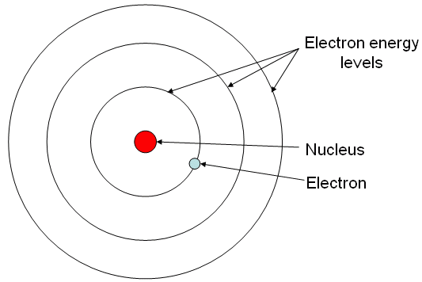
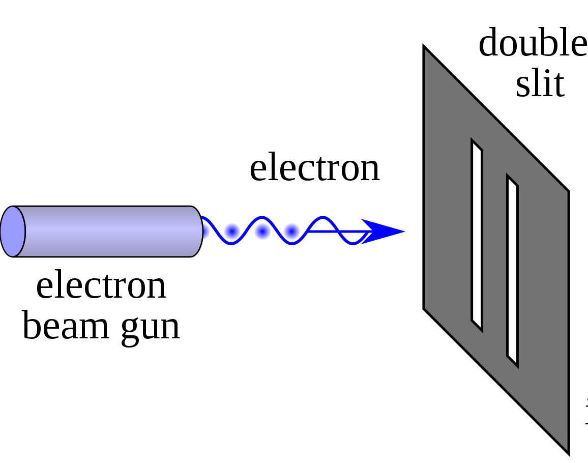
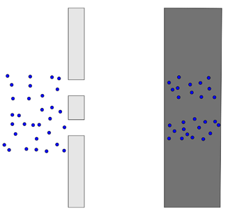
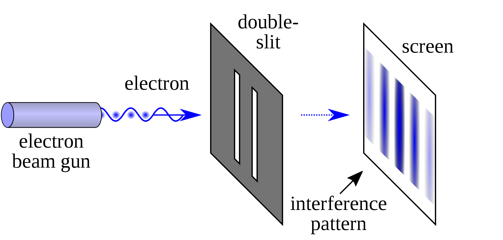
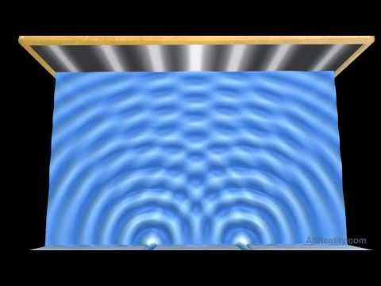
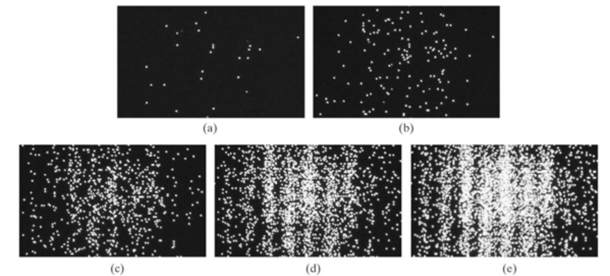

# Superficial Quantum Mechanics

Before we can start to understand how Qubits operate, there are some ideas in Quantum Mechanics you need to have a strong understanding of. A mastery of this material will prove invaluable in understanding the Bloch Sphere and Dirac Notation, two mathematical tools crucial to any quantum programmer.

The "superficial" in the title is intentional, as the concepts presented in this section are important but are introduced in a way that is as removed as possible from the actual underlying Quantum Mechanical phenomena, which will be investigated when you get introduced to the math that pairs with the field.

## What are Quantum Mechanics?

Quantum Mechanics is the mathematical framework used to describe the behavior of motion and interaction in subatomic particles.

At such small scales, Classical Physics and the Newtonian Mechanics we are intuitively familiar with in our daily lives completely falls apart and unusual properties such as __Superposition__ and __Entanglement__ begin to appear. 

Before we explain some phenomena, it's useful to know how they were identified in the first place.

## Superposition

Superposition is described as the *ability of a quantum system to be in multiple states at the same time until a measurement is performed*.

To make this vapid definition more useful to us, let's look at a physical example through an experiment known as the __Double-Slit Experiment__.

### Double-Slit Experiment

For the large majority of our youthful education, we learn to think of the atom like this:

  

pay close attention to the electrons. The way they're illustrated in particular, as point-like masses orbiting around the nucleus with an associated negative charge.

Now let's perform an experiment. We'll set up a beam of electrons aimed at a barrier with two slits and have another barrier behind it to see how the electrons come out:

  

   <i> Source: <a href=https://en.wikipedia.org/wiki/Double-slit_experiment#/media/File:Double-slit.svg> Double-slit Experiment, Wikipedia Entry</a> </i>

(The last barrier has been intentionally hidden from display)

Before we turn on the beam, let's make a prediction about what we'll see. If we go off what we know in the first image about electrons being these point-like masses, we should see the following:

  

   <i> Source: <a href= https://plus.maths.org/content/physics-minute-double-slit-experiment-0> Physics in a minute: The double slit experiment</a> </i>

The electrons will just repeatedly hit the same two places, sort of like shooting tennis balls through the same double slit but larger.

If we turn on the beam, we get the following:

  

   <i> Source: <a href=https://en.wikipedia.org/wiki/Double-slit_experiment#/media/File:Double-slit.svg> Double-slit Experiment, Wikipedia Entry</a> </i>

Note that the pattern produced is far from what we predicted! It's a continuously varying pattern of intensity, periodic in nature, that's a far stretch from what we predicted.

IT DOES however, match the pattern generated if we were to pass some kind of wave through the two slits:

  

   <i> Source: <a href=https://www.youtube.com/watch?v=0cztIj1m7e4> Double-slit Experiment - Water Wave Interference Pattern</a> </i>

Intuitively, we'd have to think that electrons must somehow be waves instead of particles. But how can something with charge and treatable as a point-like mass just turn into a wave? 

Perhaps there is a problem with our experimental setup itself. Maybe, because we're shooting a stream of electrons through the double-slits the electrons are interacting with themselves in such a way that when they hit the barrier they produce a wave interference pattern. 

Let's try just shooting one electron at a time. That should give us the two-band pattern we predicted earlier. 

What do we see?

  

The same thing! Some how, individual electrons also seem to exhibit this __wave-particle duality__ where it can behave both as a wave and a particle! What is rather remarkable is that each electron isn't "communicating" or sharing information with the electrons after it but it seems as if the electrons "know" where they need to go on the barrier to create a wave interference pattern.

This led physicist Erwin Schrodinger to formulate the idea that the electron wasn't really a particle so much as a wave spread out throughout space. This idea is extendable to other quantum mechanical systems and has a mathematical counterpart known as the __Schrodinger Equation__.

The __Schrodinger Equation__ is a *partial different equation*, which means that solving it doesn't give you a number but another function. This function is known as the __Wave Function__ which *describes the probability a quantum mechanical system will be in a certain configuration*.

Let's go back to our definition of what a superposition is:

> Superposition is the ability of a quantum system to be in multiple states at the same time until a measurement is performed.

The *states* mentioned are anything that can be measured about the particle such as location, energy, momentum, etc. In this case, our experiment concerns itself with location although the energy and momentum of a particle can be obtained from the wave function as well.

The wave function is what allows quantum systems to assume multiple states. The key here is the "probability" part, the particle or system of interest doesn't really represent ALL possible states so much as the chance it'll be in one or a "probability distribution". That's where the "measurement" part comes in.

When the electrons in our experiment interacted with the barrier, the wave function of the electron "collapses", thus forcing the electron to exist in one single location. What used to be an infinite distribution of probabilities must "pick" one value and stick with it. That means that while the particle still acts as a wave, we can't really extract any information because we can only do so through measurement which causes the whole thing to fall apart. To be more precise, we can only measure one thing at a time which means all other desirable data is permanently lost.  

We also know that due to this wave function, electrons actually look more like this:

  

the weird lobes and spheroids you see give the *probability* of an electron at a certain energy existing at a certain location around the nucleus.

## Entanglement

Quantum entanglement occurs when two or more particles become "linked", be it through creation or interaction. Whatever happens to one immediately affects the other, regardless of how far apart they are.

The more "formal" way of defining this is when the wave function of a quantum system (such as two or more particles) can't be described by two separate wave functions. That means that the measurement of one particle causes the function to collapse as a whole, resulting in the other particle exhibiting highly correlated behavior, far from random chance.

A nice way to think of this is imagine having two quarters. They are placed exactly on their sides on a table. They can represent four possible combinations, each with a 25% chance of appearing should you hit the table and let them fall flat. The possibilities are represented in the table below:

||Heads|Tails|
|---|---|---|
|Heads| 25% | 25% |
|Tails| 25% | 25% |

Now, perform the same setup but tape a piece of cardboard between the same side (connect Heads to Heads for example).

When one coin falls, the other will fall the same way and your probability turns into the following:

||Heads|Tails|
|---|---|---|
|Heads| 50% | 0% |
|Tails| 0% | 50% |

Now imagine the same thing happening over and over again, but the behavior remains when the cardboard is removed and the coins are infinitely far apart!

This analogy is essentially what Entanglement is, the perfect correlation between two particles or groups of particles. 

## No-Cloning Theorem

The __No-Cloning Theorem__ is mentioned less frequently than superposition and entanglement owing to the fact that is isn't so much a property qubits need as a consequence of quantum mechanics.

The theorem states the following:

> it is impossible to copy a quantum mechanical system in an unknown state to another quantum mechanical system

This means that if I have some quantum system in superposition, I can't "copy" that superposition onto another quantum system and have two exact copies. The reasoning behind this does not have a nice physical analogue but once you're introduced to Dirac Notation, the proof should seem straightforward enough.