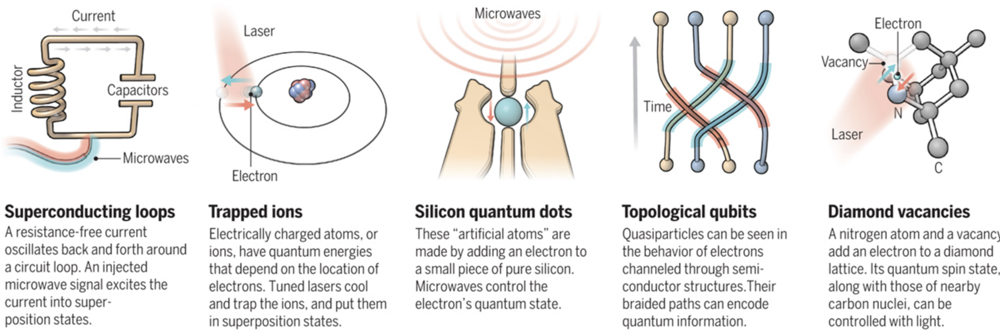

# The Qubit
In the previous section, we went over several key principles of Quantum Mechanics that govern the most fundamental operations of QC.

In this section, we look at the Qubit, analogous to the "bit" encountered in classical computers as being the fundamental unit of computation. By using multiple bits and manipulating them in certain ways, we can represent, store, and manipulate data to our desired form.

Unlike the bit however, Qubits can leverage the properties of __superposition__ and __entanglement__ we mentioned prior.

Furthermore, for anything to qualify as a qubit it MUST have the above two properties. 

## Superposition

You're already familiar with the idea of superposition as a consequence of the __wave function__ quantum systems have but now we need to understand how to put this in the context of QC.

We know our classical bit can only have the values \\(1\\) and \\(0\\). There is no inbetween, it's one or the other.

Now let's recall what the official definition of __superposition__ is: 

>the ability of a quantum system to be in multiple states at the same time until a measurement is performed.*

Our prior example of the Double-Slit experiment defined "states" to be equivalent to "locations" although we also mentioned that "any observable property" could be considered a state.

The qubit itself is a quantum mechanical system and therefore can exhibit the property of superposition with a twist: the states that we're interested in isn't location but the probability of it being a \\(1\\) or a \\(0\\).

When the qubit is measured, we're guaranteed a \\(1\\) or \\(0\\) value but the qubit can also be set to a superposition of the two values meaning that it has a probability distribution of being \\(1\\) or \\(0\\) before being measured! 

A final, important property of qubits is that although measurement will cause the qubit to collapse to \\(1\\) or \\(0\\), we can perform useful manipulations WITHIN the superposition state that affect the probability distribution. This is one of the great powers of QC. 

  

   <i> Source: <a href=https://medium.com/@kareldumon/the-computational-power-of-quantum-computers-an-intuitive-guide-9f788d1492b6> The Computational Power of Quantum Computers: an intuitive guide by Karel Dumon</a> </i>

This result should remind you of the probabilistic nature of Quantum Computation already hinted by the __BQP__ and __QMA__ complexity classes where we a problem needs to be solved correctly AT LEAST some fraction of the time to fall into the quantum complexity classes. 

All of this seems more like a nuisance than something to accelerate computation but superposition allows for a property known as __Inherent Parallelism__.

### Inherent Parallelism 

In a classical computer, we know that you can use combinations of bits to represent data. Each bit can be in one of two states giving you:

\\[ n^{2} \\]

possible combinations, where \\(n\\) is the number of bits you have. Due to the nature of classical computation, you can only manipulate one combination at a time. 

In a quantum computer however, we know that superposition allows us to represent multiple states at once. That means with each qubit added we can have

\\[ 2^{n} \\]

possible combinations, where \\(n\\) is the number of qubits you have. Furthermore, we can manipulate qubits in this superposition state which is similar to working with ALL the possible states the classical computer could represent SIMULTANEOUSLY.

Superposition and Inherent Parallelism are only part of the Qubit story. Entanglement also plays an incredibly important role.

## Entanglement

A solid grasp of the quantum mechanical definition of entanglement prior translates rather nicely to its context in QC. 

Just as particles can become entangled, so too can qubits but in a controlled fashion. 

Entanglement is particularly useful in Quantum Computing for cryptographic systems as well as quite literally being able to simulate the entanglement that proves to be so prohibitive in the Quantum Many-Body Problem.

## A Note on Platform Diversity

Before we can proceed any further, there is a "diversity" among QC platforms that needs to be addressed.

All existing platforms *guarantee* the properties of superposition and entanglement explained above. They also all suffer from the threat of __decoherence__ which will be explained after this. Beyond that and things start to get kind of hairy.

Owing to the rapid development and infancy of the field, the hardware implementation for actual qubits varies widely. Unlike how classical computation has already settled for universally using silicon and switches called "transistors" to manipulate 1s and 0s, QC is still trying to figure out what qubit design is "best". There is plenty of contention over which one is better, with each kind of implementation having its own pros and cons.

Owing to this diversity, the authors of this guide have opted not to present the hardware details too early, instead focusing on each platform individually after developing the knowledge that still remains universally applicable in QC. 

The following image gives just a sneak-peek at some of the different kinds of architectures already in existence (with the exception of Topological Qubits, which are theorized but have yet to be implemented):

  

   <i> Source: <a href=https://science.sciencemag.org/content/354/6316/1090/tab-figures-data> Quest for Qubits by Gabriel Popkin </a> </i>

There are also several models of computation qubits are being used for. 

The first and most commonly implemented is the __circuit model__ where individual qubits are manipulated using __gates__. By using a set of gates, we can arrange them in a sequence and put a qubit through it to achieve some desired result. This very similar to how current classical computers use combinations of logic gates to manipulate 1's and 0's and therefore, one of the most intuitive models. 

The following picture gives an example of a computation set up in the __circuit model__, with each line representing a qubit and each box a gate that will manipulate the qubit. 

  

   <i> Source: <a href=https://medium.com/@jonathan_hui/qc-programming-with-quantum-gates-8996b667d256> QC - Programming with Quantum Gates (Single Qubits) by Jonathan Hui</a> </i>

Gates give a great degree of flexibility in the expression of algorithms and can represent a __Quantum Turing Machine (QTM)__ which is capable of executing any Quantum Algorithm.

The circuit model is not the only one however, with __Adiabatic Quantum Computation (AQC)__ and __Gaussian Boson Sampling (GBS)__ being two other methods. Both use qubits with the properties above but can't implement a QTM, thereby limiting their ability to execute existing Quantum Algorithms. This doesn't make them any less useful however as both tackle different sets of problems in a more elegant (and/or efficient) fashion than the __circuit model__ does. 

There are certain problems that cannot be expressed nicely in terms of gates that seem to fare better through expression through AQC or GBS.

## Decoherence

Decoherence is the last property that all qubits have. However, unlike superposition and entanglement it is not required and highly undesirable.

Decoherence is when a *quantum system reverts to a classical system through interaction with its environment*. 

A classical system has no ability for superposition let alone entanglement. As a result, if decoherence occurs during qubit manipulation, errors are introduced as well as data lost.

To prevent such things from happening, most qubit architectures have there own ways of isolating qubits from the environment. The __superconducting loop__ architecture for example, is prone to decoherence due to thermal fluctuations and magnetic disturbance, requiring the whole computer to be immersed in a specialized cooling apparatus and magnetic shielding. 

On top of this, many existing Quantum Computers will also use __Quantum Error Correction (QEC)__ to recover from such errors and prolong the period of time available for computation. These protocols are drastically different from standard __Error Correction Codes (ECC)__ owing to the fact that quantum mechanics introduces the __No-Cloning Theorem__ which states that we can't copy a qubit while it's in the superposition state. This is different from the classical realm where I can literally just attach a wire and copy a \\(1\\) or \\(0\\). 

To subvert this, most QEC protocols use entanglement to determine if a qubit state changed in an undesirable fashion and to correct such an error without having to know the exact state of the qubit. 

## Criteria for Quantum Computing

At this point, you understand that the criteria a qubit must satisfy are:

* Superposition
* Entanglement

Decoherence and the No-Cloning Theorem aren't necessary but are just consequences of the quantum mechanical principles qubits work in. 

Beyond this, there is an even larger set of criteria that need to be satisfied for a device to be considered a true Quantum Computer.

At this point in time, most platforms satisfy the criteria to varying degrees but none has managed to satisfy all of them. Properties of certain qubit architectures even prohibit the realization of some of the criteria. 

These criteria are known as the __DiVincenzo Criteria__ and will be explained in the next section. The utility of knowing these criteria is it gives you an idea of the current state of QC, what things a Quantum Computer AS A WHOLE should be able to do, and the future of the field. 