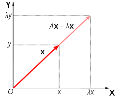

# Linear Algebra

The following are a number of operations in Linear Algebra that are core to QC. It is highly recommended you make yourself familiar with these operations and practice as necessary.

Their exact mapping to Quantum Computing/Mechanics will not be explained now but will be revealed soon enough within the sections on __Dirac Notation__ and __Core Quantum Mechanics__

## Vectors

A __Vector__ should be thought of as a quantity with *more than one piece of information*.

You may already be familiar with this kind of notation:

\\[ \vec r = 10\hat{x} + 11\hat{y} \\]

where a vector is always given as some lower-case letter with an arrow on top. 

This simply means that if I give you a point on the XY plane (say, \\( (1,1)\\) ) and I ask you to apply the above vector to it, you move 10 units in the X-direction and 11 units in the y-direction to obtain a new location: \\((11, 12)\\) 

A more succinct and equivalent notation you'll see in this book is the following:

\\[ \vec r = \begin{bmatrix}10 \\\\ 11 \end{bmatrix} \\]

where the \\(\hat{x}\\) and \\(\hat{y}\\) are implicit from the ordering of the numbers from top to bottom.

Vectors can be thought of even more abstractly as ways of grouping together related values of a system, like how in Physics we say a vector represents both *magnitude* and *direction* of a force. 

The "direction" component makes sense because after all, it does tell you where something will end up but the magnitude part is a little more elusive. We think of "magnitude" as how strong something is. It would seem intuitive to link that to how long the vector is but how do we extract that information given the two values which are reserved for telling us where to go?

The answer lies in the pythagorean theorem. Given the following vector:

\\[ \vec r = \begin{bmatrix} r_{1} \\\\ r_{2} \\\\ \vdots \\\\ r_{n} \end{bmatrix} \\]

We find its length like so:

\\[ \left\lVert \vec r \right\rVert = \sqrt{r_{1}^2 + r_{2}^2 \cdots + r_{n}^2 } = magnitude \\]

Where the double vertical bars around the vector indicate that we want its length. 

In Quantum Mechanics, vectors are used to represent the state that a system is in as well, which leads us to the topic of __Linear Combinations__

### Linear Combinations and Span

In the example above:

\\[ \vec r = 10\hat{x} + 11\hat{y} \\] 

Possesses another, more implicit meaning.

Most of us look at the \\(\hat{x}\\) and \\(\hat{y}\\) to just tell us to go some *n* units in those "directions". The "directions" however, are vectors themselves.

More specifically, they are known as __unit vectors__ which have a *magnitude* (equivalent to length) of 1. Unit vectors always have that little arrow above them (a "hat") and are useful in defining any other arbitrary vector. The set of arbitrary vectors that can be created is known as the __span__ of the vector pair and as long as your vectors aren't parallel (if you overlap them, they don't stay in a single line) you can generate any other vector you want. 

The \\(\hat{x}\\) and \\(\hat{y}\\) vectors are defined like so:

\\[ \hat{x} = \begin{bmatrix} 1 \\\\ 0 \end{bmatrix}\\]

\\[ \hat{y} = \begin{bmatrix} 0 \\\\ 1 \end{bmatrix}\\]

We can define any vector we want as a __linear combination__ of the two vectors.  This means that if I wanted to create a vector representing -10 steps in the X-direction and 20 steps in the Y-direction, I take \\(\hat{x}\\), scale it by -10 (making it longer by 10 units and go in the -x direction) and \\(\hat{y}\\), scale it by 20 (make it longer by 20 units) and combine them to get the following:

\\[ \vec r = -10\hat{x} + 20\hat{y}\\]

Or to be more verbose:

\\[ \begin{bmatrix} -10 \\\\ 20 \end{bmatrix} = -10 \cdot \begin{bmatrix} 1 \\\\ 0 \end{bmatrix} + 20 \cdot \begin{bmatrix} 0 \\\\ 1 \end{bmatrix} \\]

Now let's take things one step further. The only reason we use the \\(\\hat{x}\\) and \\(\\hat{y}\\) vectors is because of convenience. They lie directly on the x and y-axes we're already so accustomed to defining the locations of things with. 

We could just as easily define the following pair of vectors:

\\[ \vec \alpha = \begin{bmatrix} 3 \\\\ 0 \end{bmatrix} \\]

\\[ \vec \beta = \begin{bmatrix} -2 \\\\ 5 \end{bmatrix} \\]

And get any other vector we want through the following linear combination:

\\[ \vec \gamma = c_0 \vec \alpha + c_1 \vec \beta \\]

Where \\(c_0\\) and \\(c_1\\) are constant values that tell us how to scale the vectors so they can be added and get us to a point of interest. You should also note that the pair of vectors didn't have to be unit vectors either. 

This ability to create vectors from linear combinations of others is key to many qubit manipulations as quantum states can be represented as a *combination* between two base vector pairs which, can be arbitrarily defined! 

## Inner Product

The __Inner Product__ or more commonly known as the __Dot Product__ is a kind of multiplication for vectors. 

Recall that when we multiply a vector by a constant (more formally known as a __scalar__), we just multiply each element in the vector to get another vector of the same dimension.

Here's an example:

\\[ \vec r = \begin{bmatrix} 1 \\\\ 0 \\\\ 3 \end{bmatrix} \\]
\\[ c = 2\\]
\\[c \cdot \vec r = 2 \cdot \begin{bmatrix} 1 \\\\ 0 \\\\ 3 \end{bmatrix} \\ = \begin{bmatrix} 2 \cdot 1 \\\\ 2 \cdot 0 \\\\ 2 \cdot 3 \end{bmatrix} = \begin{bmatrix} 2 \\\\ 0 \\\\ 6 \end{bmatrix}\\]

The geometric interpration of this is that we have shrunk or extended (*scaled*) the vector in length. 

The __Dot Product__ is rather similar but we no longer have a constant, replacing it with another vector. The vector in question must have the SAME NUMBER OF ELEMENTS as the the vector being multiplied.

It is generalized like so:

\\[ \vec a = \begin{bmatrix} a_1 \\\\ a_2 \\\\ \ldots \\\\ a_n \end{bmatrix} \quad\quad \vec b =  \begin{bmatrix} b_1 \\\\ b_2 \\\\ \ldots \\\\ b_n \end{bmatrix} \\]
\\[ \vec a \cdot \vec b = (a_1 \cdot b_1) + (a_2 \cdot b_2) + \ldots + (a_n \cdot b_n) \\]

We took each element in the same position of each vector, multiplied the values, and then added each subsequent time to get a single value/scalar.

The following is an example with real numbers:

\\[\vec a = \begin{bmatrix} 5 \\\\ -1 \\\\ 3 \end{bmatrix} \quad\quad \vec b = \begin{bmatrix} 3 \\\\ 2 \\\\ 1 \end{bmatrix} \\]

\\[\vec a \cdot \vec b = (5 \cdot 3) + (-1 \cdot 2) + (3 \cdot 1) = 15 + -2 + 3 = 16 \\]

With this knowledge, we can redefine what it means to find the magnitude of a vector. In the beginning, we said that you could find it by taking each of its components, squaring them, adding them up and then taking the square root of it all. In essence, an augmented pythagorean theorem.

An equally valid interpretation is to take the dot product of a vector with itself and square that. The dot product merely acts as a neat alias for the squaring and square root operations making things slightly more succinct:

\\[ \left\lVert \vec a \right\rVert = \sqrt{\vec a \cdot \vec a} \\]

There is also an elegant geometric interpretation of the dot product: 

It is the "amount" that one vector overlaps or projects onto another vector as depicted in the image below:

  

   <i> Source: <a href=https://mathinsight.org/dot_product/> Math Insight - the dot product </a> </i>

That amount of "overlap" can also be interpreted as the magnitude (length) of the vector of interest times the cosine of the angle it makes with the vector it projects onto. 

The ability to do a dot product ties very closely with more advanced operations in linear algebra like __matrix multiplication__ and the __complex dot product__ which adds some more rules on top of the existing dot product presented here. 

## Matrices

Recall that we defined vectors as a quantity with *more than one piece of information*. 

Matrices can also possess the same definition but to an even *greater* extent.

Note that vectors can only have a bunch of numbers "single file". They stay in one single row or column. With matrices, you can have any arbitrary number of rows AND columns. 

They are represented as such:

\\[
\boldsymbol{A_{m,n}} = 
 \begin{bmatrix}
  a_{1,1} & a_{1,2} & \cdots & a_{1,n} \\\\
  a_{2,1} & a_{2,2} & \cdots & a_{2,n} \\\\
  \vdots  & \vdots  & \ddots & \vdots  \\\\
  a_{m,1} & a_{m,2} & \cdots & a_{m,n} 
 \end{bmatrix} 
\\]

Where we use a bold, upper-case letter to represent the matrix and access a singular value in the matrix through 1-based indexing and the notation \\(A_{m,n}\\), where \\(m = row \enspace index\\) and \\(n = column \enspace index\\). 

When we describe matrices, one of the first things we care about is the size, which is simply defined as the number of rows by the number of columns. In the example above, we would give the size as follows:

\\[ m \times n\\]

### Vectors as Matrices

Something that should be given special attention is the fact that we now define vectors as being a matrix but with a row or column size restricted to 1 (i.e. \\(m \times 1\\) or \\(1 \times n\\)). We let the other dimension be arbitrarily defined. 

Doing this introduces two types of vectors and we must now pay attention to their orientation: the __row vector__ and the __column vector__ 

The __row vector__ has dimensions \\(1 \times n\\) and looks like the following:

\\[ \vec a = \begin{bmatrix} a_1 & a_2 & a_3 & \cdots & a_n \end{bmatrix} \\]

The __column vector__ has dimensions \\(m \times 1 \\) and looks like the following:

\\[ \vec b = \begin{bmatrix} b_1 \\\\ b_2 \\\\ b_3 \\\\ \cdots \\\\ b_n \end{bmatrix} \\]

Quantum mechanics usually favors the column vector representation which is what this guide adheres to. The actual orientation is arbitrary for representing the actual values contained but for certain operations it becomes something one must be aware of. 

With this knowledge, there are two important operations you need to be able to perform with matrices: find the __Conjugate__ and __Transpose__ given any vector/matrix. 

### Conjugate

Matrices and Vectors are not just limited to holding groups of integers and it is not uncommon to encounter complex numbers when dealing with them in Quantum Mechanics.

A common operation you'll see is to find the __conjugate__ where if I had something like \\(a+bi\\), applying conjugation gives me \\(a-bi\\) and vice versa if I was given \\(a-bi\\). Note that the real component of the complex number remains untouched. 

For vectors and matrices, this just means finding the conjugate for each element: 

Given a vector:

\\[ \vec h = \begin{bmatrix} 1+i \\\\ 3-2i \\\\ 9+4i \end{bmatrix} \\]

The conjugate would be like so:

\\[ \vec h^* = \begin{bmatrix} 1-i \\\\ 3+2i \\\\ 9-4i \end{bmatrix}\\]

Given a matrix:

\\[ \boldsymbol{A} = \begin{bmatrix} 1+2i & -4i \\\\ 9+7i & 10 \end{bmatrix} \\]

The conjugate is:

\\[ \boldsymbol{A}^* = \begin{bmatrix} 1-2i & 4i \\\\ 9-7i & 10 \end{bmatrix} \\]

We use the \\(*\\) with vectors and matrices to represent the conjugate version.

### Transpose

A __transform__ simply means that we swap the rows for the columns or "rotate" the matrix around its diagonal which always spans from the upper leftmost corner to the lower right corner in a clean diagonal (doesn't skip numbers) from one value to the next. 

  

   <i> Source: <a href=http://linearalgebra.math.umanitoba.ca/math1220/section-19.html> Transpose and Trace of a Matrix, University of Manitoba, Math 1220 Linear Algebra 1 by Michael Doob </a> </i>

If I have a matrix:

\\[\boldsymbol{A} = 
    \begin{bmatrix} 
        1 & 2 & 3 \\\\ 
        4 & 5 & 6 \\\\
        7 & 8 & 9
    \end{bmatrix} 
\\]

its transform will be the following:
\\[\boldsymbol{A}^\intercal = 
    \begin{bmatrix} 
        1 & 4 & 7 \\\\ 
        2 & 5 & 8 \\\\
        3 & 6 & 9
    \end{bmatrix} 
\\]

Where the \\(T\\) denotes the transformed matrix. 

For column and row vectors, the manipulation is even easier as you're restricted to a single row or column. 

If you have a vector like so:

\\[ \boldsymbol{H} = \begin{bmatrix} 3 \\\\ 4 \\\\ 8 \end{bmatrix} \\]

Then the transform would give the following:

\\[ \boldsymbol{H}^\intercal = \begin{bmatrix} 3 & 4 & 8 \end{bmatrix} \\]

## Matrix Multiplication

Just as we can perform multiplication on vectors through the dot product, we can also do it for matrices.

Instead of focusing on individual elements however, we must turn our focus to whole rows and columns, treating them as vectors and then performing a dot product.

Before we can show how it is performed, there is also a dimension-matching requirement, similar to how vectors need to have the same number of elements for a dot product to be performed.

The requirement is that *the number of columns in first matrix must match the number of rows in the second matrix*. Furthermore, the dimensions of the resulting matrix are equal to the *number of rows in the first matrix followed by the number of columns in the other matrix*.

For example, if we are multiplying a \\(3 \times 5\\) matrix by a \\(5 \times 9\\) matrix, we know that we can perform matrix multiplication because the columns in first matrix (5) match with the rows in the second matrix (5). Furthermore, we can deduce the size of the final matrix to be \\(3 \times 9\\) from the rows in the first by the columns in the last.

You may have already noticed that this requirement leads to a rather counter-intuitive behavior you don't normally see in multiplication.

In multiplication with numbers, and even the dot product, the order of your values does not matter:

\\[2 \times 3 = 3 \times 2\\]

and

\\[\vec a \cdot \vec b = \vec b \cdot \vec a\\]

But with matrices, the order DOES matter because if I take that example above and switch the order, the dimensions are no longer valid to perform multiplication and even if they were valid, the resulting size of the matrix would be different as well.

This gives the following property:

\\[ \boldsymbol{A} \cdot \boldsymbol{B}  \neq \boldsymbol{B} \cdot \boldsymbol{A} \\]

Therefore, one has to exercise care when stating which matrix is getting multiplied by another matrix.

Now let us look at how the actual multiplication is performed.

Let us take an example of two matrices below:

\\[
\boldsymbol{A} = 
    \begin{bmatrix}
        a_{1,1} & a_{1,2} & a_{1,3} \\\\
        a_{2,1} & a_{2,2} & a_{2,3} \\\\
    \end{bmatrix}
\quad
\boldsymbol{B} = 
    \begin{bmatrix}
        b_{1,1} & b_{1,2} \\\\
        b_{2,1} & b_{2,2} \\\\
        b_{3,1} & b_{3,2} 
    \end{bmatrix}
\\]

First, we need to make sure the dimensions check out. Matrix A has the dimensions \\(2 \times 3\\) while matrix B has the dimensions \\(3 \times 2\\). We want to perform \\(\boldsymbol{A} \cdot \boldsymbol{B}\\). The columns of A match the rows of B in size and furthermore, we can deduce the resulting matrix must have the dimensions of \\(2 \times 2\\). We can therefore perform the operation.

It goes like so:

\\[
\begin{bmatrix}
    a_{1,1} & a_{1,2} & a_{1,3} \\\\
    a_{2,1} & a_{2,2} & a_{2,3} \\\\
\end{bmatrix}
\cdot
\begin{bmatrix}
    b_{1,1} & b_{1,2} \\\\
    b_{2,1} & b_{2,2} \\\\
    b_{3,1} & b_{3,2} 
\end{bmatrix} = 
\begin{bmatrix}
    a_{1,1} \cdot b_{1,1} + a_{1,2} \cdot b_{2,1} + a_{1,3} \cdot b_{3,1} & a_{1,1} \cdot b_{1,2} + a_{1,2} \cdot b_{2,2} + a_{1,3} \cdot b_{3,2} \\\\
    a_{2,1} \cdot b_{1,1} + a_{2,2} \cdot b_{2,1} + a_{2,3} \cdot b_{3,1} & a_{2,1} \cdot b_{1,2} + a_{2,2} \cdot b_{2,2} + a_{2,3} \cdot b_{3,2}
\end{bmatrix}
\\]

Notice that to get the first row of values in the resulting matrix, we take the dot product of the first row of the first matrix with with the first column of the second matrix, then the second column of the second matrix. For the second row of the result, take the dot product with the first column of the second matrix, then the second column again.

This pattern holds true for any kind of matrix multiplication, where you take the rows in the first matrix and iterate through the columns in the second matrix, dot producting each and producing a single value that gets put into the final matrix. 

## Complex Dot Product

The standard Dot Product was already well defined for our "dimensionless" explanation, where vectors were just groupings without any orientation.

However, we also introduced the accepted definition of vectors as being matrices fixed by 1 row or 1 column (row and column-based vectors respectively).

This doesn't bode well because we now have to factor in the rules for matrix multiplication. We can't arbitrarily choose where to start multiplying and adding like we could with the standard dot product because with the normal dot product, orientation of the vector is nonexistent.

To make the problem a little more apparent, we can use the following. Imagine I want to perform a dot product on the two vectors:

\\[ \vec \alpha = \begin{bmatrix} \alpha_{1} \\\\ \alpha_{1} \end{bmatrix} \quad \vec \beta = \begin{bmatrix} \beta_{1} \\\\ \beta_{2} \end{bmatrix} \\]

If you use the dimension-matching criteria mentioned earlier, you'll bump into our first problem: the dimensions simply don't permit multiplication. We have \\(2 \times 1\\) matrix getting multiplied by a \\(2 \times 1\\) matrix. The number of columns in the first DOES NOT match the number of rows in the second. 

To fix this, we use a matrix operation we're already familiar with: the transform.

We apply it on \\( \vec \alpha \\) to get \\( \vec \alpha^\intercal \\) and thus produce the following pair:

\\[ \vec \alpha^\intercal = \begin{bmatrix} \alpha_{1} & \alpha_{1} \end{bmatrix} \quad \vec \beta = \begin{bmatrix} \beta_{1} \\\\ \beta_{2} \end{bmatrix} \\]

Now we can perform matrix multiplication and get the dot product:

\\[ \vec \alpha^\intercal \cdot \vec \beta = 
    \begin{bmatrix} 
        \alpha_{1} &
        \alpha_{2}
    \end{bmatrix} 
    \cdot 
    \begin{bmatrix} 
        \beta_{1} \\\\
        \beta_{2}
    \end{bmatrix} 
    =
    \alpha_{1} \cdot \beta_{1} + \alpha_{2} \cdot \beta{2} 
\\]

Notice that we still get a single scalar value, which maintains the validity of our geometric intuition of the dot product: the amount one vector overlaps/projects onto another vector.

We can now define the dot product in terms of matrix multiplication like so:

\\[ \vec \alpha \cdot \vec \beta = \boldsymbol{\alpha}^\intercal \cdot \boldsymbol{\beta} \\]

There is however, yet another problem that needs to be addressed. Imaginary numbers play a key role in Quantum Mechanics and it is impossible to avoid the topic of using them.

Let us take the example finding the magnitude of a vector with imaginary values. Remember, the only thing introducing imaginary numbers here does is changing the nature of the y-axis so it represents complex values (those with "i" in them) while the x-axis remains real.

We'll use our newfound definition for the dot product this time:

\\[\vec a = \begin{bmatrix} i \\\\ 0 \end{bmatrix} \\]
\\[\left\lVert \vec a \right\rVert = \sqrt{\vec a \cdot \vec a} = \sqrt{\boldsymbol{a} \cdot \boldsymbol{a}^\intercal} 
= \sqrt{\begin{bmatrix} i & 0 \end{bmatrix} \cdot \begin{bmatrix} i \\\\ 0 \end{bmatrix}} = \sqrt{i^{2}} = i\\]

Mathematicians do not like the idea of having a quantity with real physical implication (length of the vector) be defined in imaginary terms. Thus, we have to tweak our definition of the dot product even further.

To guarantee a real result, we take the *conjugate* AND *transpose* of one of the vectors (the order of operations doesn't matter here) which gives us the following definition for the dot product 1:

\\[ \vec \alpha \cdot \vec \beta = (\boldsymbol{\alpha}^\intercal)^{*} \cdot \boldsymbol{\beta} \\]

There is a special name for the conjugate transpose of a matrix: the __Hermitian Conjugate__. Due to the general laziness of mathemticians, there is a notation for this operation:

\\[ (\boldsymbol{\alpha}^\intercal)^* = (\boldsymbol{\alpha}^{*})^\intercal = \boldsymbol{\alpha}^\dagger \\]

Where we now refer to the matrix as "alpha dagger" in this new notation.

Now we have arrived a truly rigorous definition of the dot product in terms of matrix multiplication.

This "Complex Dot Product" will be used very frequently in manipulating Qubit states through the application of Hermitian Conjugates.

## Outer Product

The Outer Product can always be thought of as the naive brother of the Inner Product. 

Instead of the summation that usually happens when we apply the dot product to each row versus column of the first and second matrices respectively, we just multiply!

Given two vectors as matrices:

\\[ \boldsymbol{u} = 
    \begin{bmatrix} 
        u_1 \\\\ 
        u_2 \\\\ 
        \vdots \\\\
        u_m
    \end{bmatrix}
    \quad
    \boldsymbol{v} = 
    \begin{bmatrix}
        v_1 \\\\
        v_2 \\\\
        \vdots \\\\
        v_n
    \end{bmatrix}
\\]

The cross product looks like the following:
\\[ \boldsymbol{u} \otimes \boldsymbol{v} =
    \begin{bmatrix}
        u_1v_1 & u_1v_2 & \cdots & u_1v_n \\\\
        u_2v_1 & u_2v_2 & \cdots & u_2v_n \\\\
        \vdots & \vdots & \ddots & \vdots \\\\
        u_mv_1 & u_mv_2 & \cdots & u_mv_n
    \end{bmatrix}
\\]

We just take one element from one vector and then multiply it once with each element from the other vector. This produces a row inside the matrix and we repeat the process for the second, third, fourth element until we hit the end, producing a full matrix.

The outer product is used for combining the states of quantum systems. 

## Eigenvectors and Eigenvalues

Matrix multiplication, when generalized to any kind of matrix, does not have the most intuitive geometrical interpretation.

However, there is one specific setup that does lend itself very nicely to visualization and it is this:

\\[ 
    \begin{bmatrix} 
        a & b \\\\
        c & d \\\\
    \end{bmatrix}
    \cdot
    \begin{bmatrix}
        c_0 \\\\
        c_1
    \end{bmatrix}
    =
    \begin{bmatrix}
    x \\\\
    y
    \end{bmatrix}
\\]

The following is known as a __linear transformation__. If you imagine that \\(a, b\\) and \\(c, d\\) represent two vectors, then by interpreting the dot product you know that vector \\(c_0, c_1\\) will scale each vector and when you add them together, you get a new vector, which should be the \\(c_0, c_1\\) vector but with each of its components in a new orientation and magnitude. 2

The __Eigenvector__ is a special vector that, when it has a matrix applied to it, only scales in magnitude. It can grow or shrink, flip directions as well but it has to maintain the same direction (lay on the same line).

If this is true, there is an associated __Eigenvalue__ which performs the equivalent action the matrix would in terms of scaling. 

The image below should sum all this up:

  

   <i> Source: <a href=https://en.wikipedia.org/wiki/Eigenvalues_and_eigenvectors> Eigenvalues and Eigenvectors</a> </i>

Where "A" is the matrix and "x" is the eigenvector, with lambda being the eigenvalue. 

## Eigenfunctions and Eigenvalues

An __Eigenfunction__ and its __Eigenvalue__ have a similar relationship to that of the eigenvector and eigenvalue. We have some function that undergoes some transformation but could be equivalently represented as a function multiplied by a constant. 

The "transformation" is a placeholder for the idea of an "operator" which we'll explore in more detail when we get to Core Quantum Mechanics. It's essentially something that acts upon a function to produce yet another function. 

Just as the relationship for eigenvector and eigenvalue is expressed like so:

\\[\boldsymbol{A} \vec x = \lambda \vec x\\]

The relationship between eigenfunction and eigenvalue is:

\\[\hat{O}f = qf\\]

where \\(q\\) is a constant, \\(f\\) a function and \\(\hat{O}\\) an operator.

An example is the following:

We can define \\(\frac{d}{dx} \\) to be an operator that works on a function defined in terms of x. As mentioned above, an operator should take some function and produce another function. We pick the function \\(e^{3x}\\) and get the following:

\\[\frac{d}{dx}(e^{3x}) = 3e^{3x}\\]

This looks rather similar to the relationship we defined above. If we match things up, we know our constant \\(q\\) should be \\(3\\) (our eigenvalue) and that our eigenfunction is \\(e^{3x}\\).

## Vector Spaces

A great deal of the complex mathematics in Quantum Mechanics are greatly simplified with the help of something known as a **Hilbert Space** In order to understand what a **Hilbert Space** is however, we have to look at something called a vector space.

A **Vector Space** is defined as a set of vectors \\(V\\) with the operations of addition and scalar multiplication which follow the following properties (formally known as **axioms**), where \\(\vec u, \vec v, \vec w \\in V\\) and \\(c,d\\in \\mathbb{R} \\) (set of all real numbers).

1.)  \\( (\vec u + \vec v) \\in V \\)

Adding two vectors in \\(V\\) should produce another vector that is in \\(V\\)

2.) \\(\vec u + \vec v = \vec v + \vec u\\)

Commutativity, the order of addition should not matter

3.)  \\(\vec u + (\vec v + \vec w) = (\vec u + \vec v) + \vec w\\)

Associativity, the way additions can be grouped should not matter either 

4.)  \\(\vec 0 + \vec u = \vec u\\)

The existence of the 0 vector which, when added with any vector produces the same vector

5.)  \\(\vec v + -\vec v = 0\\)

All vectors must have inverses which, when added to their counterpart sum to 0

6.) \\(c \cdot \vec u \in V\\)

Scaling a vector must produce a vector which is in the set \\(V\\)

7.) \\(c \cdot (\vec u+ \vec v) = c \cdot \vec u + c \cdot \vec v\\)

The Distributive Property: if I multiply the sum of vectors by a constant, it would produce the same result as multiplying each individual vector and then adding the result together

8.) \\((c + d)\cdot u = c \cdot \vec u + d \cdot \vec u \\)

If you flip the values in prior rule where the constants are the ones being added, the distributive property still holds true

9.) \\( c \cdot (d \cdot \vec u) = (c \cdot d) \cdot \vec u \\)

This shows the assocativity principle again, but we account for scalar multiplication of the vectors

10.) \\(1\cdot \vec u = \vec u\\)

Scaling a vector by 1 should give the same vector back 3

The reason we present this to you is because of the fact that the "set of vectors" doesn't actually have to be just a set of vectors! It can be extended to many other mathematical entities, such as polynomials and arbitrary functions (so long as they follow the axioms above). If you are skeptical about this property, I encourage you to take some arbitrary polynomial and subject it to the above (multiplying a polynomial by a polynomial gives: another polynomial, so does addition, multiplying by a constant, etc.)

What makes this highly desirable is we can work with incredibly complex functions using the tools linear algebra already gives us.

This brings us to the **Hilbert Space**, which is a __type__ of vector space that has a few more rules added to it but proves incredibly nice to work with when we reach core Quantum Mechanics

## Hilbert Space 4

**Hilbert Space** is a type of vector space which satisfies the 10 axioms above but introduces a handful of others.

### Inner Product Operation

One of the main definitions is that of an **inner product**. You'll remember that we introduced it as the **dot product** although that term is more specific to real numbered vectors which have a clear geometric interpretation 

The notation for the inner product is slightly different from what we've presented for the dot product.

Where the dot product was represented like so: 

\\[ \vec a \cdot \vec b \\] 

We now do the same thing but with angled brackets:

\\[ \langle \vec a, \vec b \rangle \\]

Furthermore, for the examples below we will stop treating the "things" in Hilbert Space as vectors and encourage your to think of them as "elements", owing to the fact that the section of Vector Spaces already proves their ability to be used with arbitrary functions.

The inner product in Hilbert Space has a couple of rules which go as follows.

#### Conjugate Symmetry

**Conjugate Symmetry** states that the inner product of two elements in Hilbert Space is the conjugate of the inner products but in opposite order.

This gives the following:

\\[\langle a , b \rangle =  \langle b, a \rangle^*\\]

#### Linearity With Respect to the First Vector

\\[\langle a, bc + de \rangle  = b\langle a, c\rangle + d\langle a, e\rangle \\]

\\(a, c, e\\) are all elements of the Hilbert Space while \\(b, d\\) are real constants. 

#### Antilinearity With Respect to the Second Vector

\\[\langle ab + cd, e \rangle = a^* \langle b, e \rangle + c^* \langle c, e \rangle\\]

\\(b, d, e\\) are all elements of the Hilbert Space while \\(a, c\\) are real constants. Notice that unlike the above property, the conjugates of the constants have to be taken in order for the equality to hold. 

#### Positive Definite 

If we take the inner product of an element with itself, we are GUARANTEED a value greater than 0, unless the element in question is 0 itself which just produces 0

\\[\langle a, a\rangle = \mid a \mid^2 \geq 0 \\]

### Separability

The idea of **separability** means that the Hilbert Space has a **countable**, **dense**, **subset**.

Let's break that down with a comparison to the real numbers \\(\mathbb{R}\\) which also possess this property of separability. 

We know that the set of rational numbers \\(\mathbb{Q}\\) is a **subset** of \\(\mathbb{R}\\) as \\(\mathbb{R}\\) contains both rational AND irrational numbers. 

We also know that that \\(\mathbb{Q}\\) is **countable** as all rational values can be expressed as the ratio of two integers which themselves are countable (they are more properly known as *countably infinite* owing to the fact that the set of integers, also a subset of the real numbers, goes on to infinity).

Furthermore, the set of rational numbers is **dense** meaning that we can find some rational number that can get arbitrarily close to an irrational number in the set of real numbers. A nice way of visualizing this is the fact that pi can be better and better approximated with fractions that have larger integer values in the numerator and denominator of a fraction.

### Completeness

__Completeness__ is the fact that as two values in the space get arbitrarily close to each other, we should still get a value that exists within the space itself.

A more formal way of stating this is that the __Cauchy Sequence__ within the space will produce a value that also exists in the space.

## Types of Hilbert Space 5

There are two types of Hilbert Spaces:

* Finite Dimensional
* Infinite Dimensional

Some more detail on the distinction is given below

### Finite Dimensional Hilbert Space

In the Finite variation, the basis vectors that you can make other vectors with or more generally, the elements that permit you to make other elements, are finite.

All the examples you saw with the dot product and matrices use a pair of finite, vectors.

### Infinite Dimensional Hilbert Space

In the infinite variation (and the one we'll be doing the great majority of our work in) we have a infinite number of basis elements to create other elements from.

The importance of this will be made clear as we dive more into Core Quantum Mechanics but there is another property which should be committed to heart:

All functions in this space are **square integrable** 

This means the following property must be true:

\\[ \int_{-\infty}^\infty \mid f(x)\mid^2 = finite \\]

We are guaranteed a finite value for such integrals.

## Citations

1. [DO YOU EVEN DOT PRODUCT BRO? - Andrew Dotson](https://www.youtube.com/watch?v=Qpm85nC2BBE&ab_channel=AndrewDotson)
2. [Eigenvectors and Eigenvalues | Essence of Linear Algebra, chapter 14 - 3Blue1Brown](https://www.youtube.com/watch?v=PFDu9oVAE-g&ab_channel=3Blue1Brown)
3. [Vector Spaces - The Definition - 3 Problems - patrickJMT](https://www.youtube.com/watch?v=8DYyKKCBDBQ&ab_channel=patrickJMT)
4. [An Introduction to Hilbert Spaces - Faculty of Khan](https://www.youtube.com/watch?v=7zx3MT9FgT0&list=PLdgVBOaXkb9Bv466YnyxslT4gIlSZdtjw&index=2&ab_channel=FacultyofKhan)
5. [Introduction to Hilbert Spaces - Important Examples - Faculty of Khan](https://www.youtube.com/watch?v=ua-Y4k0gq8w&list=PLdgVBOaXkb9Bv466YnyxslT4gIlSZdtjw&index=3&ab_channel=FacultyofKhan)